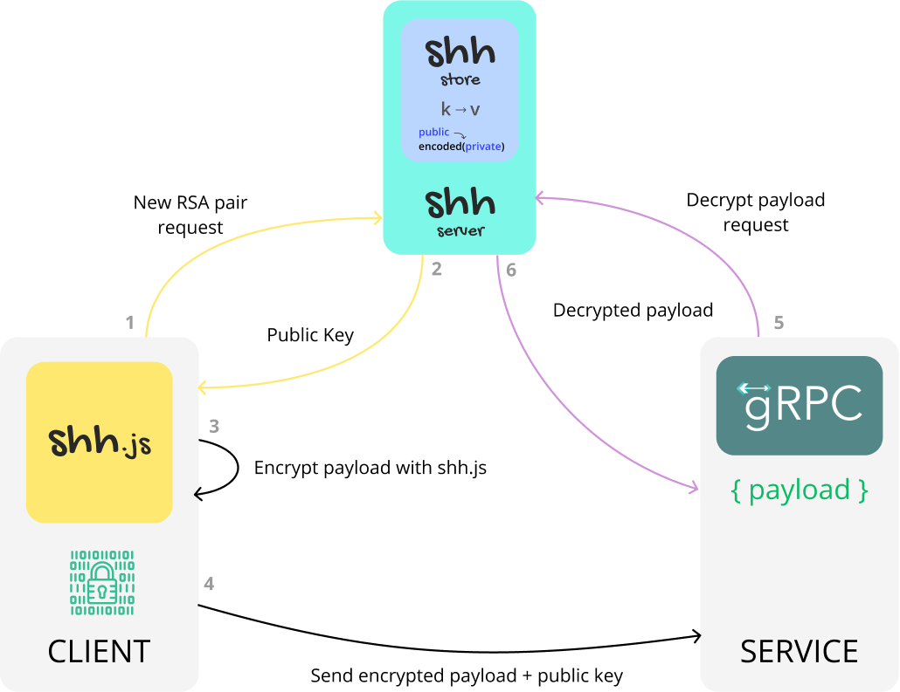

# SHH

A simple "shh" for your browser-server trades.

It's only a very simple service to generate temporal RSA Keypairs and use it for encode your browser -> server trades. In the graphic below you can see how SHH works.

